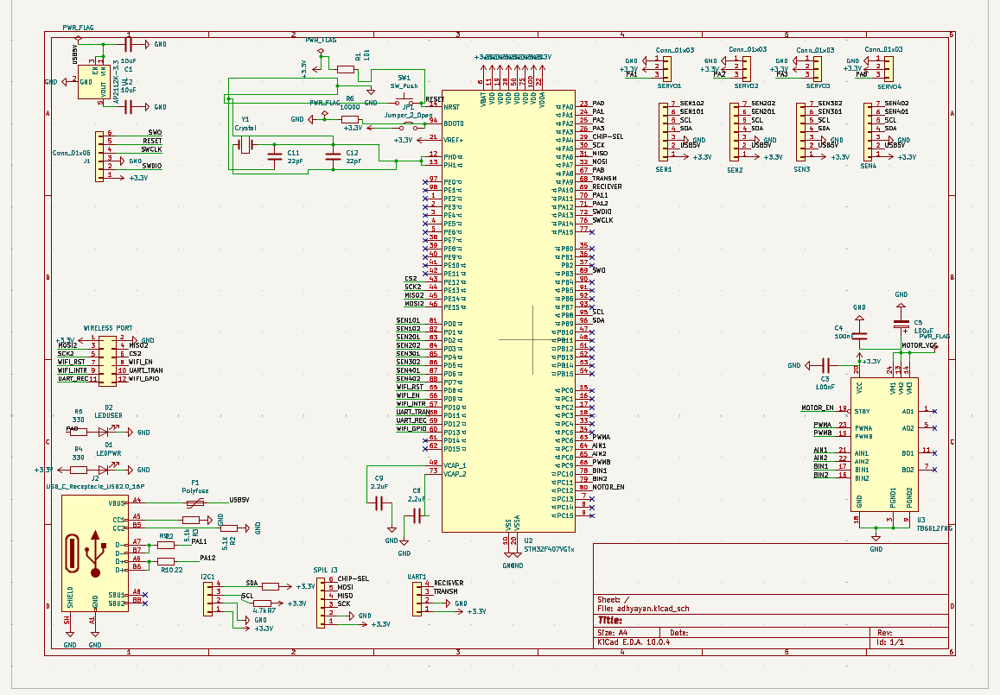
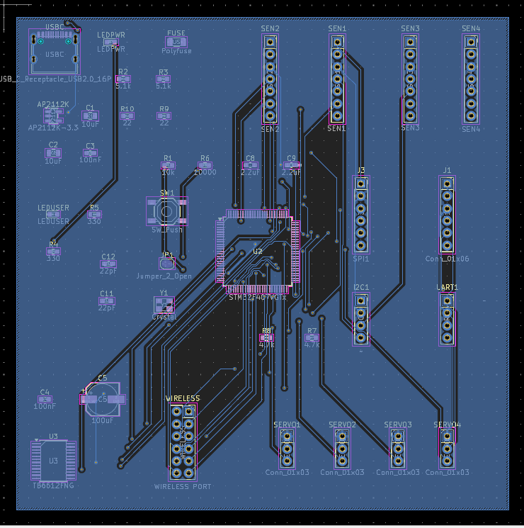
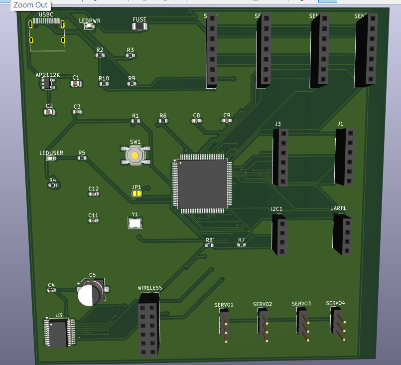

# Orion-1

Orion-1 is the first version of a custom robotics controller PCB designed in KiCad. The goal of this project is to develop a compact and modular controller for robotics applications while improving my PCB design and embedded systems skills.

> **Status**: Version 1 (Prototype)

## Features

- STM32-based controller
- USB-C programming interface
- 3.3V regulated power supply
- Servo output headers
- DC motor interfaces
- Expansion headers for sensors

## Tools

- KiCad 9

## Images

### Schematic

### PCB Layout

### 3D View

## Notes

This is the first iteration of Orion. The design is functional but still has room for improvement. Future revisions will focus on cleaner routing, improved power distribution, additional communication interfaces, and enhanced expandability.

## LinkedIn Post : https://www.linkedin.com/posts/adhyayan-tiwari-at_electricalengineering-embeddedsystems-pcbdesign-ugcPost-7480876964183179264-PRkA/?utm_source=share&utm_medium=member_desktop&rcm=ACoAADK-H94BgaTVqvPJFy2czKfNLIw63XJDhiA
